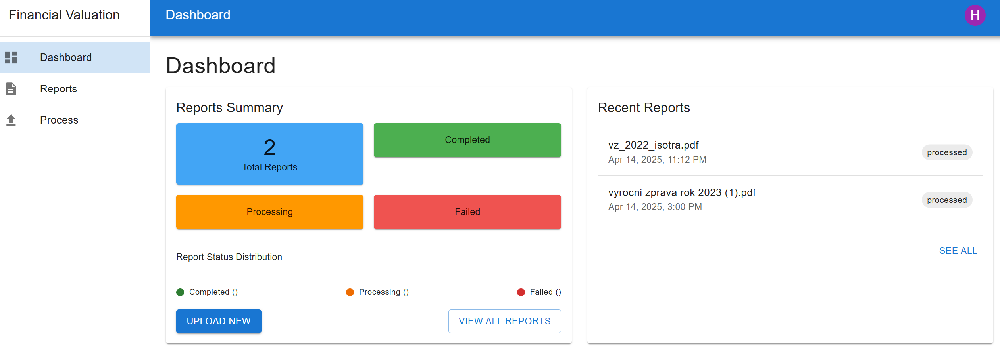
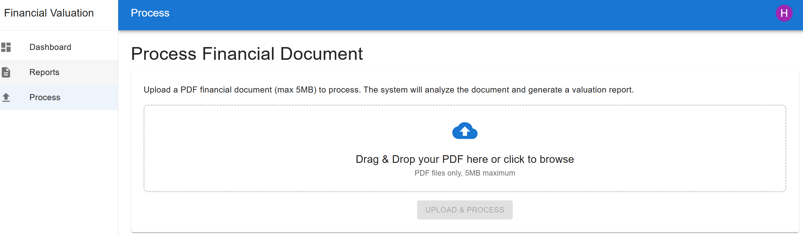
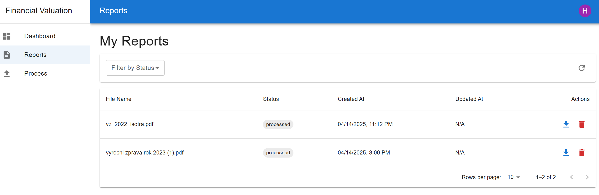

# Financial Statement Analysis & Valuation Service

This project provides an automated service for analyzing financial statements and valuating companies using OCR and Large Language Models. The system processes uploaded financial documents, extracts relevant information using OCR, and generates comprehensive valuation reports.

## Overview

The service combines several advanced technologies:
- **OCR Processing**: Uses Mistral to extract text from financial documents
- **Text Analysis**: Leverages OpenAI models to process and analyze financial data
- **Storage**: Utilizes Supabase for database storage and blob storage for reports

## Features

- Upload financial statements for processing
- Automated extraction of key financial metrics
- AI-powered company valuation
- Comprehensive report generation

## Dashboard

## Processing Flow

## Reports

## Technology Stack

- **Backend**: FastAPI (run with Uvicorn)
- **Frontend**: React/Next.js
- **AI Models**: Mistral (OCR), OpenAI (text processing)
- **Storage**: Supabase

## Running the Application

uvicorn backend.main:app

### Backend

npm run dev